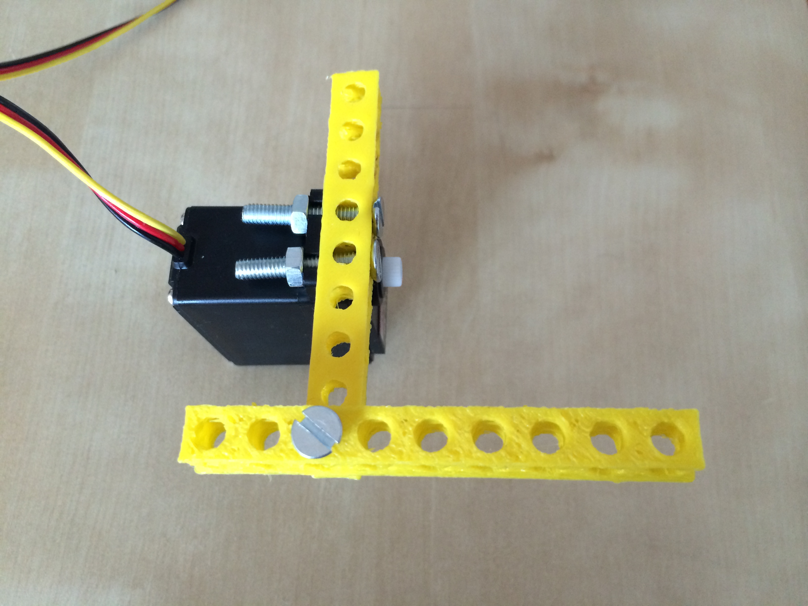
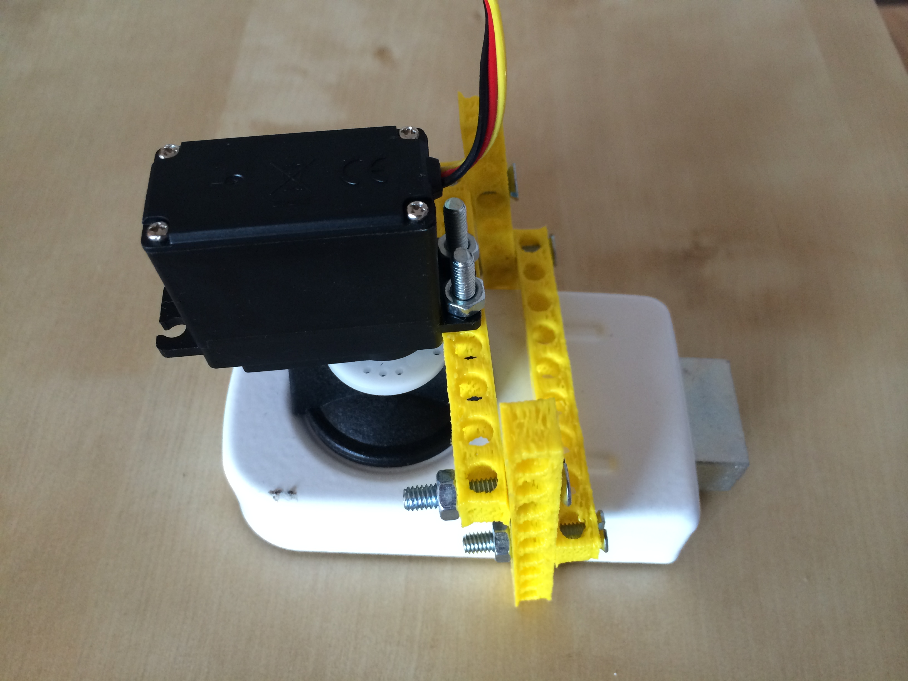

\newpage
\thispagestyle{empty}
\mbox{}

\newpage

\customtitlepage{Hack Your House}

>Have you ever wanted to live in a house like the Jetsons? We will be taking the first step into this inevitable future in our workshop! You will learn to build a system that opens and closes door based on motion in front of it, just like in Star Trek.

### Authors

__Jon Gottfried__ has been hacking on hardware since 2005, where he built competitive autonomous firefighting robots with PIC boards. Lately, he has been working on some home automation projects and phone-controlled robots that he is turning into tutorials for Twilio DIY Home Automation using Twilio and Twilio Robot as well as some Google Glass-controlled robots for fun. He loves hacking and loves teaching.

__Wojtek Siudzinski__ is a software developer and DIY hacker for more than a decade. Currently connects everything to the internet (including his washing machine) with his open-home project. Wojtek writes his code in Python and Objective C. You had a chance to catch his Arduino workshop at Maker Meetup.

__Mateusz Kozak__ is a ruby developer and hardware hacker at Enyuka Studio. He wants to make your home listen and speak to you like Iron Man’s J.A.R.V.I.S. During latest researches he started to fall in love with python.

\newpage

# Hack Your House

## Overview

In this workshop you will learn how to build your own motion controlled deadbolt lock. We will be using an Arduino Uno, a servo, a PIR motion sensor, and four 3D printed elements called Bitbeams.

## Preparations

Download the Arduino IDE from <http://arduino.cc/en/Main/Software> and install it on your system.

## Main flow

### Step 1: Hello Robot!

We are going to start off by making sure that you are able to upload code to your Arduino using the Blink tutorial (<http://arduino.cc/en/tutorial/blink>). One of the best things about Arduino is the amazing open source community that exists around it. We will be making use of a number of open source examples as we build our smart lock!

Plug your LED power into pin 13 of your Arduino and ground into the GND pin next to it. The shorter pin is Ground (-) for LEDs.

Plug your Arduino into your computer via USB.

Open the Arduino IDE, select: *File > Examples > 01.Basics > Blink* and click the *Upload* button to install the Blink program on your board.

If you successfully uploaded your program, the LED that you plugged into your Arduino should be blinking on and off every second!

### Step 2: Connect and Test a Servo

Now that we are sure that you can program your Arduino, we will move on to the fun stuff and connect our servo to our board.

A servo is a type of motor that typically has a 180 degree movement radius. Later in the workshop, we will be using our servo to control the movement of a deadbolt lock.

For now, we just want to connect our servo to our Arduino and make sure we are able to control it via a simple program.

A servo motor has three wires - power (red), ground (black), and control (frequently yellow or white). Connect the power wire to the 5V pinout on the Arduino and the ground wire to the GND pinout next to it. We can then connect the control wire to Digital Pin 12 on our Arduino as in the following diagram:

Now that our servo is connected to the Arduino, we will need to write the software to control it. Let’s create a new file and start it off with the following code:

~~~~ {.numberLines}
#include <Servo.h>
Servo myservo;
~~~~~~~

This snippet includes the Servo library and defines a new Servo object that we will use later to control our servo motor.

Next, we can create two methods: `loop()` and `setup()` - these methods are common to every Arduino program. The `setup()` method runs when the Arduino turns on, and the `loop()` method constantly runs on a loop (as the name would suggest).

In our `setup()` method, we will attach our myservo object to pin 10 where we plugged in the servo earlier. The method should look like this when we are done:

~~~~ {.numberLines}
void setup()
{
  myservo.attach(12);
}
~~~~~~~

Now that the Arduino knows where to find our Servo, we can experiment a bit. In order to move the servo to a new position, you use the `myservo.write(pos);` method. pos is an integer from 0 to 180. Try using `myservo.write(pos);` in both the `setup()` and `loop()` methods - see what happens when you set pos to different values. Note that you can use the delay() method to pause execution between different commands.
For example:

~~~~ {.numberLines}
  myservo.write(180);
  delay(1000);
  myservo.write(0);
~~~~~~~

This snippet would move the servo to position 180, pause for 1 second, and then move the servo to position 0.

After each modification, Upload your code to the Arduino again. You can view the progress of your upload in the log console on the bottom of your Arduino IDE.

Once you are comfortable with controlling your Servo, we can move on. Additional examples are available here: <http://arduino.cc/en/Tutorial/Sweep>

### Step 3: Mounting to your lock

Now that the software side of our project is done, we must mount the servo to our deadbolt lock. To do this, we'll use 3D printed elements called Bitbeams which are open source alternatives to LEGO Technic blocks.

Firstly, screw one Bitbeam to the servo. Use 5th and 6th hole from left.

\newpage

Then screw left vertical beam on its 3rd hole.

Do the same with right vertical beam.

Now screw horizontal beam.

\newpage

Voila! You can try mounting the servo on deadbolt:

If all fitts, tighten all screws so servo won't rotate.

### Step 4: Motion-Controlled Deadbolt

We will unlock or lock our door every time we detect movement in front of it.

Take the PIR motion sensor and wire it into your Arduino (VCC to +5V, GND to GND, and control to digital pin 2) - NOTE that the middle wire of the PIR sensor is GND, not the black wire. This is strange, but true. The red (+) wire is still VCC (the sensor should have a + and AL marking on it to distinguish this):

You will need to use an internal pull-up to activate the motion sensor. This is done by setting digital pin 2 as an INPUT pin and then writing a HIGH value to it. Once you Arduino turns on, you need to wait a second or two for the PIR motion sensor to get a reading on a room without movement. Then you can start waving your arms all around!

When motion is detected, lock or unlock your deadbolt.

You can find additional details on the sensor here: <https://www.sparkfun.com/products/8630>

If you get stuck you can find the solution here: <https://gist.github.com/jonmarkgo/9060847>

Great work and happy hacking!
